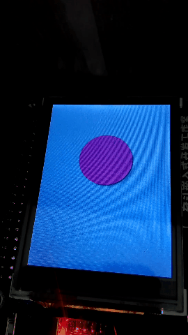
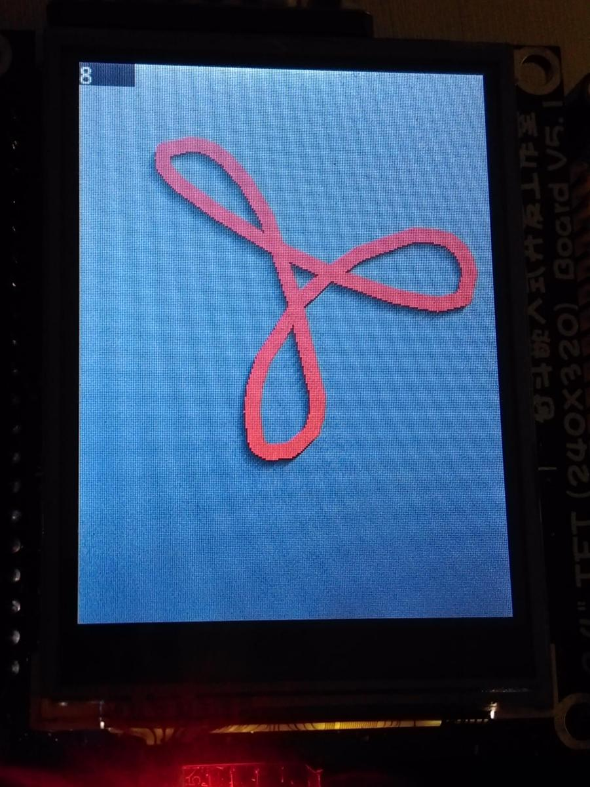
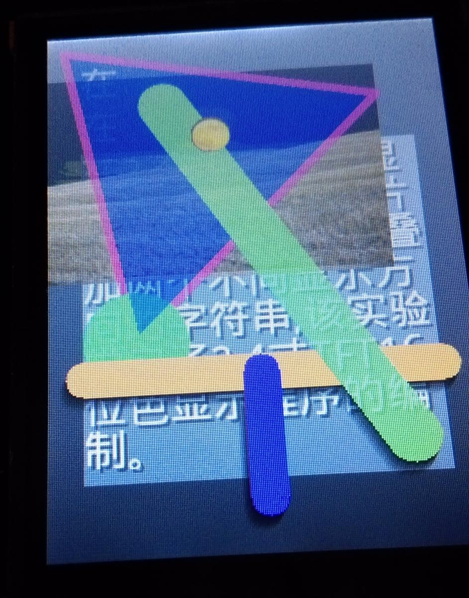

MINI-demo_clock
====
A demo of better UI running on STM32F103 for ILI9325/8080 LCD interface.

Works on 奋斗STM32-MINI [http://ourstm.taobao.com][] in 34fps

md_button.c
----
This present a Material Design like button demo:

More Gallery
----

[http://ourstm.taobao.com]: http://ourstm.taobao.com
